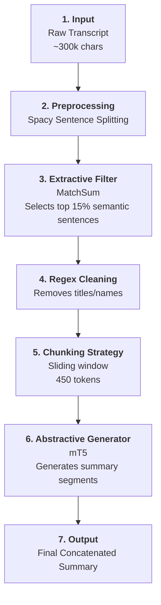
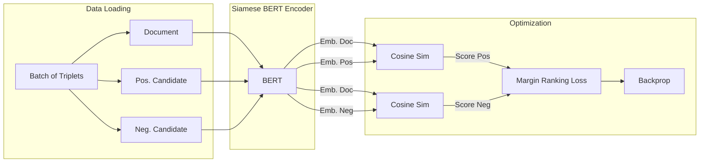
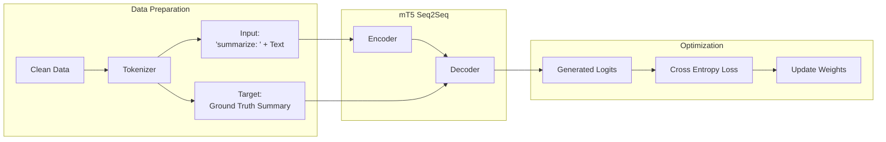

# Ro-MeetingSum

**Ro-MeetingSum** is a comprehensive pipeline for summarizing Romanian parliamentary meetings (Camera Deputaților). It includes modules for scraping raw transcripts, cleaning and segmentation, and training/evaluating both extractive and abstractive summarization models.

## 📂 Project Architecture

The project is structured efficiently in `src/`:

-   **`src/scrapers`**: Fetches raw data from the official CDEP website.
-   **`src/processing`**: Cleans transcripts, removes procedural boilerplate, and segments sentences.
-   **`src/models`**: Contains model architectures (e.g., Siamese BERT for extractive summarization).
-   **`src/training`**: Scripts for fine-tuning MatchSum (extractive) and mT5 (abstractive) models.
-   **`src/inference`**: Inference logic, including chunking strategies for long documents.
-   **`src/evaluation`**: Comparative evaluation using ROUGE metrics.
-   **`src/config.py`**: Centralized configuration for file paths and parameters.

## 🏗️ Pipeline Diagram

The following diagram illustrates the Hybrid Summarization Pipeline:



## 💾 Project Data & Models

You can download the full project archive, including scraped data and trained model checkpoints, from the following link:
[**Download Models & Data**](https://drive.google.com/file/d/1zPDl1pwS08In28DZZwXUG_cwKTj_ROWB/view?usp=sharing)

## 🚀 Installation

1.  **Environment Setup**: Ensure you are using Python 3.9+ (tested with 3.12).
    
    ```bash
    # Create and activate a virtual environment
    python3 -m venv .venv
    source .venv/bin/activate
    ```
    
2.  **Install Dependencies**:
    
    ```bash
    pip install -r requirements.txt
    ```
    
3.  **Download Spacy Model**: The pipeline uses Spacy for sentence segmentation.
    
    ```bash
    python -m spacy download ro_core_news_sm
    ```
    

## 🛠️ Usage

The project uses a central CLI entry point: `main.py`.

### 1. Data Scraping

Fetch meeting transcripts and summaries from the CDEP website.

```bash
# Scrape sessions from ID 8000 to 9000
python main.py --scrape --start-id 8000 --end-id 9000
```

*Output*: `data/processed/cdep_8000_9000.json`

### 2. Data Cleaning

Process the raw JSON to remove noise and prepare it for training.

```bash
python main.py --clean
```

*Output*: `data/processed/clean_dataset_final_8000_9000.json`

### 3. Training/Fine-Tuning

To train the models, it would be recommended to have a GPU/MPS available.

**Extractive Model (MatchSum)**:

```bash
python main.py --train-ext
```

**Abstractive Model (mT5)**:

```bash
python main.py --train-abs
```

### 4. Evaluation

Compare the performance of the Extractive, Abstractive (Hybrid), and Baseline models using ROUGE scores.

```bash
# Evaluate on a subset of 64 meetings
python main.py --evaluate --test-size 64
```

## 📊 Models

-   **Extractive**: Uses a Siamese BERT (`distilbert` or `bert-base-romanian-cased-v1`) to score the relevance of each sentence in the context of the document.
-   **Abstractive**: Fine-tunes `google/mt5-small` to generate coherent summaries from the extracted key sentences.

## 🧠 Training Pipelines

### 1. Extractive Model (MatchSum)
The extractive model is trained using a **Siamese Network** structure with a triplet loss approach. It learns to rank "Positive" candidate summaries (high ROUGE overlap with ground truth) higher than "Negative" candidates.



### 2. Abstractive Model (mT5)
The abstractive model is fine-tuned largely using standard **Seq2Seq** techniques with Teacher Forcing.



## 📄 License

This project is for educational and research purposes. Data is sourced from public parliamentary records.